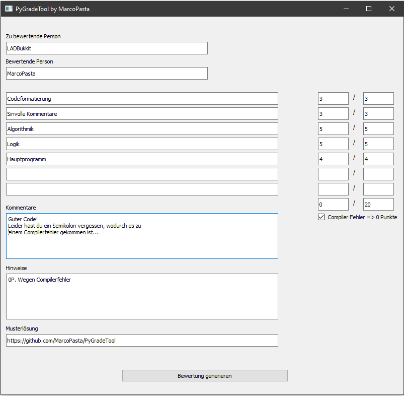
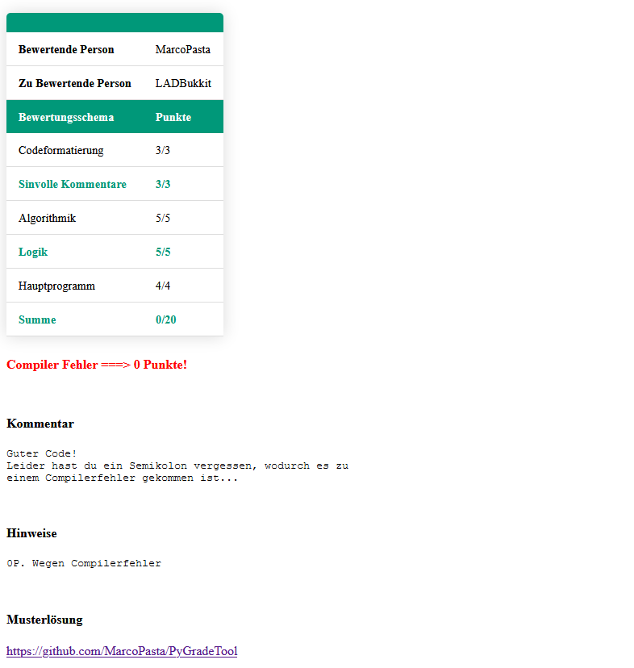

# PyGradeTool
MarcoPastas Cross-Platform PyGradeTool für die Bewertung von Studenten. Geschrieben in Python mit dem PyQt5 Framework, executables erstellt mit PyInstaller.
___
# Nutzung
Das Tool erstellt eine .html-Datei mit dem angegeben Namen + ".html". Dabei wird bei dem eingegebenen Namen das Leerzeichen gefiltert und durch ein '_' ersetzt. 

Bei der Erstellung der HTML Datei wird eine Tabelle erzeugt, welche den Namen des zu bewertenden Studenten, Name des Tutors so wie eine Tabelle mit dynamisch kreierten Kriterien. Es können bis zu maximal 7 Kriterien angegeben werden. Zu den Kriterien können ebenfalls Punkte vergeben werden aus denen die Summe der Punktzahl berechnet wird. Falls es bei dem Code zu einem Compilerfehler kommt, kann man über eine Checkbox einen Compilerfehler angeben, dadurch bekommt der Student automatisch 0 Punkte, allerdings kann er seine "potenziellen Punkte" noch einsehen. Neben den Kriterien können auch Kommentare, Hinweise sowie eine Musterlösung angegeben werden.

Um das Programm zu starten muss die im Repo enthaltene pygradetool.py mit Python gestartet werden. Wer möchte kann sich über das Pkg Pyinstaller eine executable erstellen und diese ins WD schieben (alternativ die .exe Datei in das WD schieben.)
___
# Installation 
mit folgenden schritten installiert ihr das Tool: 
* `python3-venv` über den PackageManager deiner Distro installieren.
* Auf Windows ist venv bei der Installation schon dabei.
* VirtualEnvironment erstellen mit `python3 -m venv venv` Erstellt einen  Ordner mit dem Namen `venv`.
* Linux: venv betreten mit `source venv/bin/activate`.
* Windows: venv betreten mit `venv\Scripts\activate`.
* Packages nachinstallieren mit `pip install -r requirements.txt`. Hierbei werden die Packages PyQt5 und Pyinstaller installiert
* VirtualEnvironment verlassen mit `deactivate`.

Eine Executable kann wie folgt erstellt werden: 
```bash
pyinstaller --onefile --windowed pygradetool.py
```
Bei dem Fehler `missing \_bootlocale`: 
```bash
--exlude-module \_bootlocale
```

Wer sich an der Entwicklung beteiligen möchte kann sich gerne bei mir melden :) 
___
# Betriebssysteme
PyGradeTool ist in Python mit der PyQt5 Library geschrieben und sollte deshalb auf jedem Betriebssystem laufen. 

## Getestete Betriebssysteme
* Windows 10 ✔️
* MacOS ✔️
* Linux:✔️
___
# Danksagung
Eine Danksagung geht raus an:
* Mr. Kinau, welcher das Template bereits in Java gecoded hat 
* LADBukkit für das finden ein paar Bugs
* ScarfedFox für das Testen und finden eines libc6 Bugs
___
# To Do
* Summe soll während der Laufzeit angezeigt werden und nicht erst beim generieren
* Icon für das Programm erstellen

# Erledigt
* Umlaute auf allen Betriebssystemen darstellen.
* Generierte HTML Dateien haben statt Leerzeichen ein '_' im Dateinamen.
* Compilerfehler Button hinzufügen, welcher eine Meldung dazu ausgibt.
___
# Bilder


